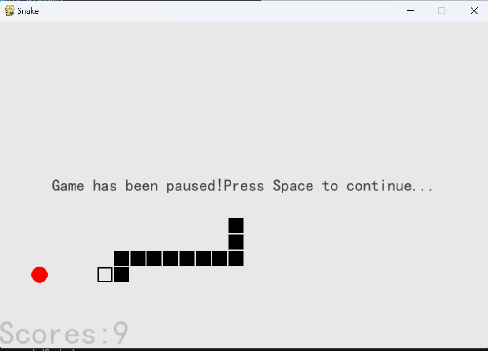
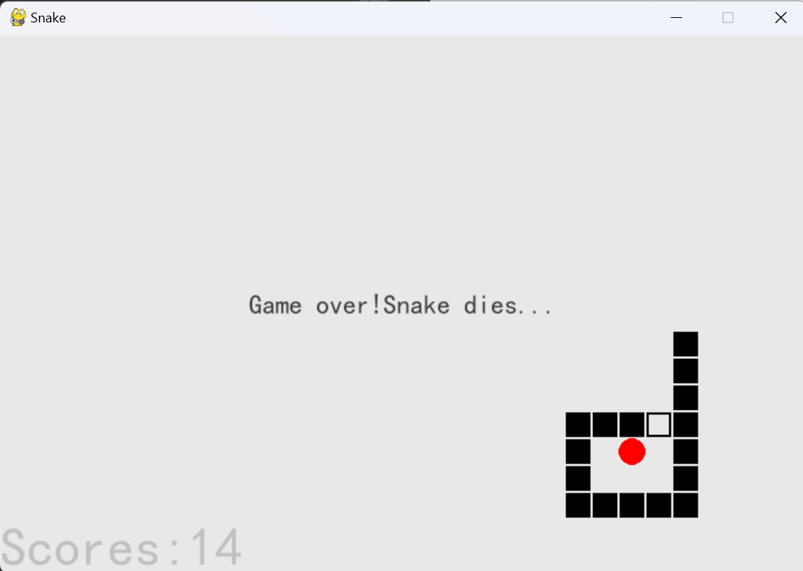

# 贪吃蛇游戏项目

## 概述
该项目使用 `pygame` 库实现了经典的贪吃蛇游戏。玩家控制一条蛇收集食物，每吃掉一块食物，蛇的长度会增加。如果蛇撞到自己或游戏边界，游戏结束。



---

## 功能
- **游戏状态管理：**
  - 按下 `Space` 键暂停游戏。
  - 在游戏结束后可以重新开始。
- **动态游戏体验：**
  - 蛇会移动并在吃到食物后变长。
  - 蛇吃到食物后移速增加。
  - 随机生成食物位置。
  - 食物15秒没被吃到自动消失更新位置。
- **分数追踪：**
  - 在游戏窗口顶部显示当前分数。
- **键盘控制：**
  - 使用方向键（`上`、`下`、`左`、`右`）控制蛇的移动。
  - 按下 `ESC` 退出游戏。

---

## 安装
1. **Python：** 确保系统上已安装 Python，游戏要求 Python 3.7 或更高版本。
2. **依赖库：** 安装 `pygame` 库：
   ```bash
   pip install pygame
   ```
3. **项目文件：**
   - 项目包含以下关键文件：
     - `game.py`：游戏的主入口。
     - `game_items.py`：包含游戏对象（如 `Snake`、`Food` 和 `Label`）的实现。

---

## 运行方式
1. 进入包含 `game.py` 文件的目录。
2. 运行以下命令：
   ```bash
   python main.py
   ```

---

## 控制说明
| 键         | 动作                                   |
|-------------|---------------------------------------|
| `方向键`   | 控制蛇向指定方向移动。                 |
| `Space`     | 暂停/继续游戏。                       |
| `ESC`       | 退出游戏。                            |

---

## 代码亮点
### 核心组件：
1. **`Game` 类：**
   - 管理主游戏循环、渲染和事件处理。
   - 处理游戏状态转换（例如暂停和重新开始）。

2. **`Snake` 类（在 `game_items.py` 中）：**
   - 表示蛇及其行为（例如移动、吃食物）。
   - 检测碰撞并相应地更新蛇的状态。

3. **`Food` 类（在 `game_items.py` 中）：**
   - 随机生成食物位置。

4. **`Label` 类（在 `game_items.py` 中）：**
   - 显示分数和游戏结束消息等文本信息。

---

## 自定义
- **网格大小：**
  - 通过调整 `Game` 类中的 `24*30`（宽度）和 `24*20`（高度）修改游戏网格。
- **蛇的速度：**
  - 调整蛇移动的频率。

---


## 未来改进
- 添加食物消耗和游戏结束的音效。
- 实现额外的游戏元素，如墙壁或增强道具。

---


